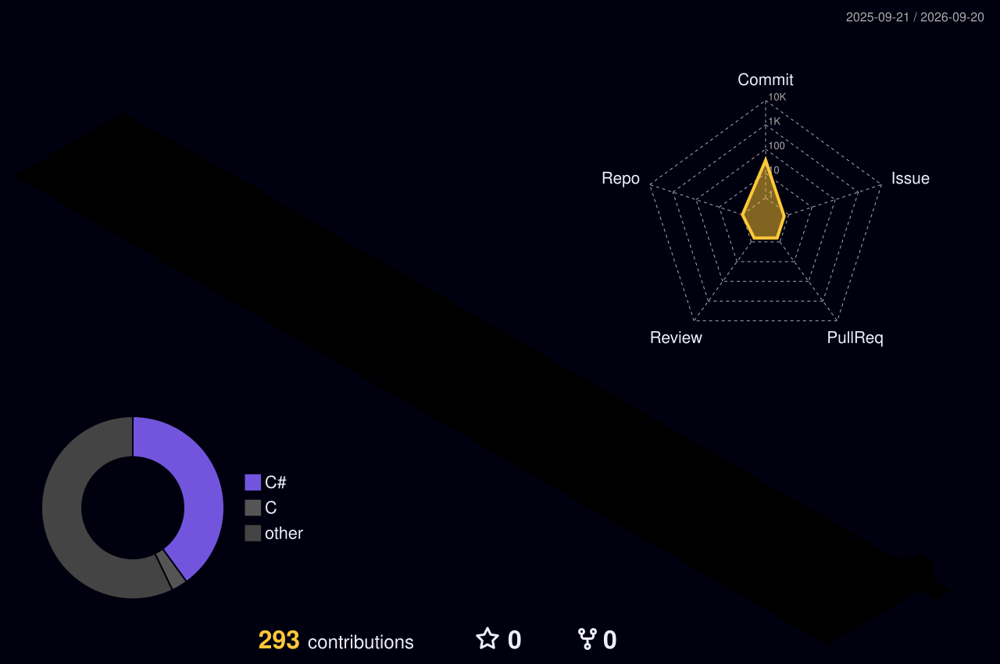

# Bin0Ary

### Computer Engineering Student • ASP.NET Core Backend Developer

 

 

## 💻 System

## ⚙️ Tech Stack

---

## 🌌 Contribution Landscape

---

## 📊 GitHub Dashboard

---

## 🐍 Contribution Snake

  

---

## 🎯 Current Goals

- Build production-quality ASP.NET Core applications
- Learn distributed systems and scalable architectures
- Contribute to open source
- Continue improving software design skills

---

*"Programs must be written for people to read, and only incidentally for machines to execute."*

— Harold Abelson

